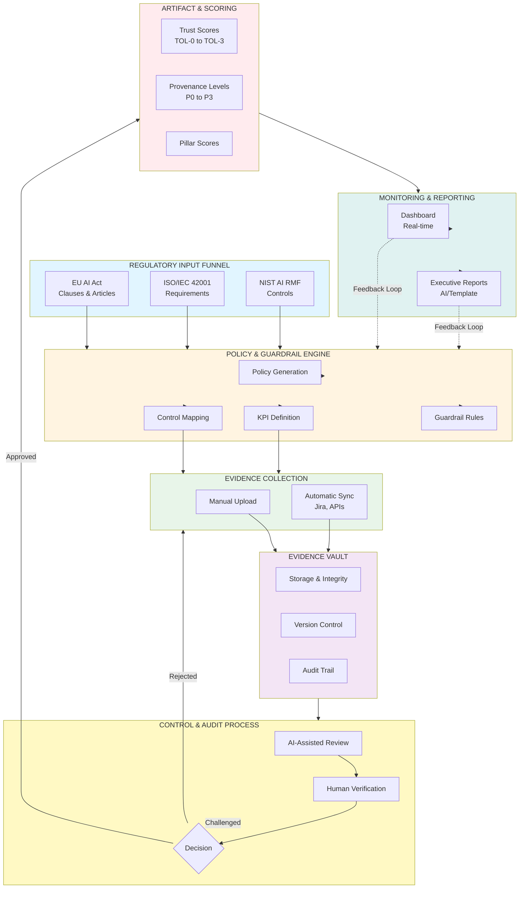
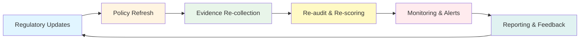
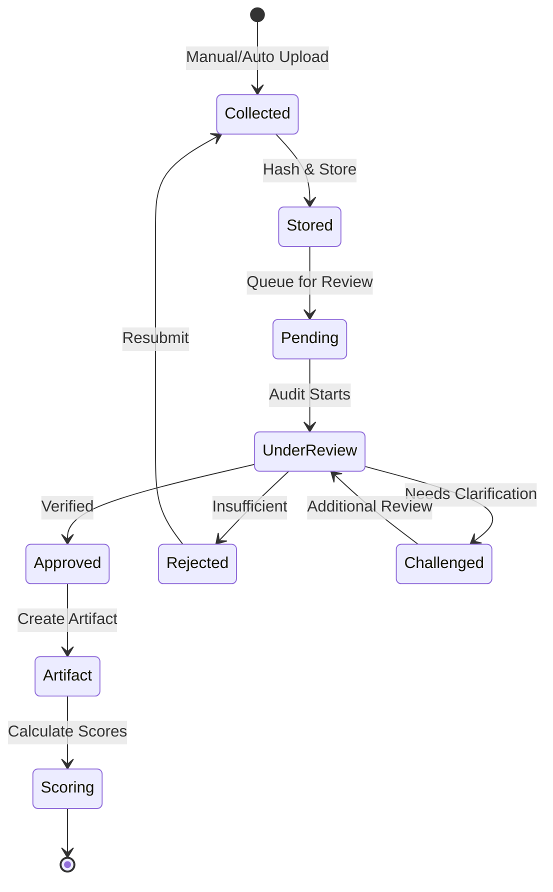
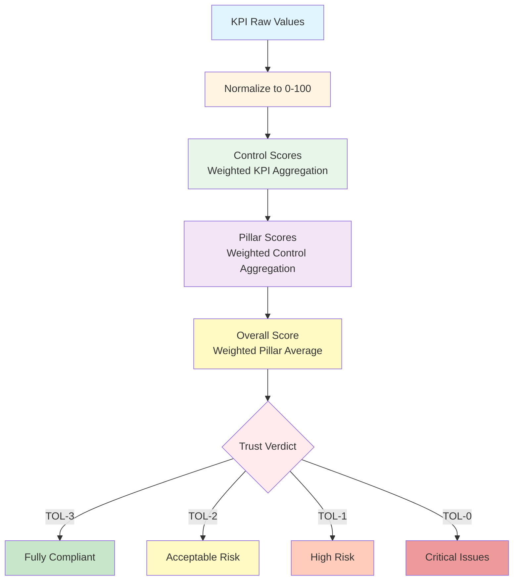

# LeadAI Process Flow - Visual Diagram

## Complete Process Flow

```mermaid
graph TB
    subgraph Input["REGULATORY INPUT FUNNEL"]
        R1[EU AI Act<br/>Clauses & Articles]
        R2[ISO/IEC 42001<br/>Requirements]
        R3[NIST AI RMF<br/>Controls]
    end
    
    subgraph Engine["POLICY & GUARDRAIL ENGINE"]
        P1[Policy Generation]
        P2[Guardrail Rules]
        P3[KPI Definition]
        P4[Control Mapping]
    end
    
    subgraph Collection["EVIDENCE COLLECTION"]
        E1[Manual Upload]
        E2[Automatic Sync<br/>Jira, APIs]
    end
    
    subgraph Vault["EVIDENCE VAULT"]
        V1[Storage & Integrity]
        V2[Version Control]
        V3[Audit Trail]
    end
    
    subgraph Audit["CONTROL & AUDIT PROCESS"]
        A1[AI-Assisted Review]
        A2[Human Verification]
        A3{Decision}
    end
    
    subgraph Scoring["ARTIFACT & SCORING"]
        S1[Trust Scores<br/>TOL-0 to TOL-3]
        S2[Provenance Levels<br/>P0 to P3]
        S3[Pillar Scores]
    end
    
    subgraph Monitoring["MONITORING & REPORTING"]
        M1[Dashboard<br/>Real-time]
        M2[Executive Reports<br/>AI/Template]
    end
    
    R1 --> Engine
    R2 --> Engine
    R3 --> Engine
    
    Engine --> P1
    Engine --> P2
    Engine --> P3
    Engine --> P4
    
    P3 --> Collection
    P4 --> Collection
    
    E1 --> Vault
    E2 --> Vault
    
    Vault --> Audit
    
    A1 --> A2
    A2 --> A3
    A3 -->|Approved| Scoring
    A3 -->|Rejected| Collection
    A3 -->|Challenged| Audit
    
    Scoring --> Monitoring
    Monitoring --> M1
    Monitoring --> M2
    
    M1 -.->|Feedback Loop| Engine
    M2 -.->|Feedback Loop| Engine
    
    style Input fill:#e1f5ff
    style Engine fill:#fff4e1
    style Collection fill:#e8f5e9
    style Vault fill:#f3e5f5
    style Audit fill:#fff9c4
    style Scoring fill:#ffebee
    style Monitoring fill:#e0f2f1
```

## Recursive Process Cycle

```mermaid
graph LR
    A[Regulatory Updates] --> B[Policy Refresh]
    B --> C[Evidence Re-collection]
    C --> D[Re-audit & Re-scoring]
    D --> E[Monitoring & Alerts]
    E --> F[Reporting & Feedback]
    F --> A
    
    style A fill:#e1f5ff
    style B fill:#fff4e1
    style C fill:#e8f5e9
    style D fill:#fff9c4
    style E fill:#ffebee
    style F fill:#e0f2f1
```

## Evidence Lifecycle

```mermaid
stateDiagram-v2
    [*] --> Collected: Manual/Auto Upload
    Collected --> Stored: Hash & Store
    Stored --> Pending: Queue for Review
    Pending --> UnderReview: Audit Starts
    UnderReview --> Approved: Verified
    UnderReview --> Rejected: Insufficient
    UnderReview --> Challenged: Needs Clarification
    Rejected --> Collected: Resubmit
    Challenged --> UnderReview: Additional Review
    Approved --> Artifact: Create Artifact
    Artifact --> Scoring: Calculate Scores
    Scoring --> [*]
```

## Scoring Flow

```mermaid
graph TD
    A[KPI Raw Values] --> B[Normalize to 0-100]
    B --> C[Control Scores<br/>Weighted KPI Aggregation]
    C --> D[Pillar Scores<br/>Weighted Control Aggregation]
    D --> E[Overall Score<br/>Weighted Pillar Average]
    E --> F{Trust Verdict}
    F -->|TOL-3| G[Fully Compliant]
    F -->|TOL-2| H[Acceptable Risk]
    F -->|TOL-1| I[High Risk]
    F -->|TOL-0| J[Critical Issues]
    
    style A fill:#e1f5ff
    style B fill:#fff4e1
    style C fill:#e8f5e9
    style D fill:#f3e5f5
    style E fill:#fff9c4
    style F fill:#ffebee
    style G fill:#c8e6c9
    style H fill:#fff9c4
    style I fill:#ffccbc
    style J fill:#ef9a9a
```
