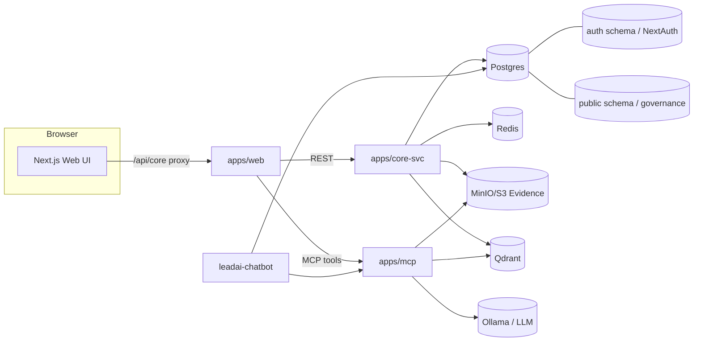

# LeadAI Tech Stack & Workflow (Full, Code-Accurate)

This document reflects the **current repository state** and maps the major technical components, multi-entity model, and governance workflow **as implemented in code and Docker infrastructure**. It is intentionally detailed and operational.

---

## 1) Repository Structure (Where Things Live)

- **Frontend (Next.js):** `apps/web`
- **Core API (FastAPI):** `apps/core-svc`
- **Regulatory Service:** `apps/reg-svc`
- **Certificate Service:** `apps/cert-svc`
- **MCP Server:** `apps/mcp`
- **Chatbot + Ingest:** `leadai-chatbot` + `leadai-chatbot-ingest` (Docker services)
- **PII Worker:** `pii-regex-worker` (Docker service)
- **Mock Jira:** `apps/mock-jira`
- **Migrations:** `apps/core-svc/alembic/versions`
- **Docs:** `docs/`

---

## 2) Tech Stack (Exact Runtime Components)

### Frontend (apps/web)
- **Framework:** Next.js 15.5.5 (App Router)
- **Language:** TypeScript
- **UI Runtime:** React 19.1.0
- **Styling:** Tailwind CSS 4.1.14
- **Internationalization:** `next-intl` (EN/TR)
- **Auth:** NextAuth v5 (email/passwordless) with Prisma Adapter
- **Charts:** `recharts`
- **PDF/Report Export:** `html2canvas`, `jspdf`, `pdf-lib`
- **Data Fetching:** Server Components + `/api/core` proxy to core-svc
- **Entity Context:** entity slug in URL + `X-Entity-ID` propagation

### Backend (apps/core-svc)
- **Framework:** FastAPI
- **Language:** Python 3.11+ (code compatible; venvs may use later)
- **ORM (sync):** SQLAlchemy
- **Async DB:** `asyncpg` (async pools)
- **DB Driver (sync):** `psycopg` for batch/report processing
- **Migrations:** Alembic
- **Reports:** `fpdf2`, `python-pptx`
- **Doc Parsing:** `pypdf`, `python-docx`, `pandas` (Knowledge Vault ingest)
- **HTTP Client:** `httpx`
- **Scheduling:** Internal asyncio schedulers in `app.main`

### AI / LLM
- **Provider:** Ollama (local), OpenAI, Anthropic, Google (configurable)
- **LLM Report Generation:** core-svc `app/services/llm.py` + `app/routers/ai_reports.py`
- **LLM Report Types:** `ai_summary_llm`, `governance_requirements_report`, `board_level_report`, `board_level_deck`
- **LLM Report Caching:** `llm_report_cache` (by `report_type`, `data_hash`, `entity_id`)
- **LLM Report Schedule:** `llm_report_schedule` (`/admin/ai-reports/schedule`)
- **Report Next Steps:** `report_next_steps` (manual overrides for board-level reports)
- **Provenance Evaluation:** YAML rules with scoring + gates

### RAG & Knowledge Vault
- **Vector DB:** Qdrant
- **Embedding Provider:** Ollama embeddings (default `nomic-embed-text`)
- **Knowledge Vault Storage:** `report_sources` + `report_source_files` tables, S3/MinIO objects
- **Indexing Service:** `knowledge_vault_ingest.py` -> Qdrant

### Data & Storage
- **Postgres 15 (pgvector image)**
- **Redis 7** (queues + caching)
- **MinIO (S3)** (evidence + knowledge sources)
- **Qdrant** (vector search)

---

## 3) Docker Services (docker-compose.yml)

**Core infrastructure:**
- `postgres` (pgvector/pg15)
- `redis`
- `minio`
- `qdrant`

**API & workers:**
- `core-svc` (FastAPI)
- `alert_worker` (async policy + governance alerts loop)
- `reg-svc` (regulatory/trust decay service)
- `reg-worker` (Celery worker for `trust_decay` queue)
- `cert-svc` (Trustmark issuance)

**AI & RAG:**
- `mcp` (MCP server -> Qdrant + Ollama)
- `leadai-chatbot` (API adapter + RAG access to MCP)
- `leadai-chatbot-ingest` (PGVector ingest loop)
- `pii-regex-worker` (PII detection against doc roots)

**Dev tooling:**
- `mock-jira` (Jira adapter for evidence + risk registers)

---

## 4) High-Level Architecture

---

## 5) Web App Runtime (How Requests Flow)

### A) `/api/core` Proxy (Next.js)
- The Next.js route `apps/web/src/app/api/core/[...slug]/route.ts` forwards requests to core-svc.
- It injects **`X-NextAuth-User-ID`** from the NextAuth session.
- It forwards **`X-Entity-ID`** or `?entity_id` so the backend resolves entity context.

### B) Entity-Scoped Navigation
- Primary UI routes are entity-scoped: `/{entitySlug}/scorecard/...`.
- Server pages use `validateEntityAccess()` and `findEntityBySlug()` to ensure the user has access.
- Legacy routes under `/scorecard/...` remain but are gated by nav mode.
- `LEADAI_NAV_MODE=legacy` forces redirects to legacy routes.

### C) Ops Health Surface
- Web health UI: `/health` (polls every 30s).
- Aggregator API: `/api/health` checks HTTP services + TCP ports + pgvector readiness details.
- Overall status currently blocks on web/core-svc/mcp/qdrant/ollama/minio/redis/postgres.

### D) Entity Name in Header
- `useEntityName()` reads `entitySlug` from `next/navigation` params and fetches `/api/core/entity/by-slug/{slug}`.
- Header subtitle automatically appends the entity name.

---

## 6) Auth + Multi-Entity Access Control (Core-Svc)

### Identity Flow
- NextAuth email provider creates users in `auth."User"`.
- `user_mapping` maps NextAuth user IDs (cuid) -> backend UUID.
- core-svc uses `X-NextAuth-User-ID` and `user_mapping` to identify the backend user.

### Entity Access
- `user_entity_access` grants a **role per entity**: `admin`, `editor`, `viewer`.
- `get_entity_id_with_auth_*` dependencies enforce role checks and entity access.
- `get_entity_id_or_first_for_viewer` falls back to **first accessible entity** when entity_id is missing (e.g., `/projects`).

### System Admin (Master Admin)
- The UI labels this area **"System Admin"** (EN) / **"Sistem Yöneticisi"** (TR); entity switcher shows **"Choose Entity"** when in system-admin context.
- Master admins are defined by `MASTER_ADMIN_USER_IDS` (backend UUIDs).
- Master admins can access any entity without `user_entity_access` entries.
- Master admin API: `/admin/master/*`.

---

## 7) Data Model (Entity-Scoped by Design)

All tenant-scoped tables include **`entity_id`** (UUID) and **`entity_slug`** (text). The slug is denormalized for fast filtering and URL alignment.

### Core Identity & Entity Tables
- `entity` (source of truth for `slug`, `status`, legal info)
- `user_mapping` (NextAuth cuid -> backend UUID)
- `user_entity_access` (role grants per entity)
- `entity_archive` (archived entity snapshots)

### Projects & Translations
- `entity_projects` (projects per entity)
- `project_translations` (localized project fields)

### Catalog & Configuration
- `pillars`, `kpis`, `controls`, `kpi_definition`
- Override tables:
  - `entity_kpi_overrides`
  - `entity_control_overrides`

### KPI & Control Execution
- `control_values` (raw_value, normalized_pct, kpi_score, unit, owner_role, evidence_source)
- `control_values_exec` (owner, due dates, reminders, status, notes)
- `pillar_overrides` (manual pillar overrides)

### Evidence & Audit
- `evidence` (S3 URI, sha256, size, status)
- `evidence_audit` (review, download, status changes)
- `audit_events` (global audit log)

### Requirements & Policies
- `ai_requirement_register`, `euaiact_requirements`, `iso42001_requirements`
- `policies`, `policy_versions`, `policy_alerts`
- `entity_policy_register`, `entity_policy_register_status`

### Intelligent Alerts & Trends
- `alert_rules` (threshold / trend_drop rules per entity/project)
- `trend_alerts` (generated alerts)

### Provenance & Trust
- `provenance_*` tables (artifacts, datasets, models, lineage, evaluations, manifests)
- `trust_evaluations`, `trustmarks`, `trust_monitoring_signals`, `trust_decay_events`
- `trust_axis_pillar_map` (global mapping of pillars to trust axes)

### Model Providers
- `entity_provider_artifacts` (provider docs/assurances per entity; OpenAI/Anthropic/Google/Meta)

### Reporting & Knowledge Vault
- `llm_report_cache` (caches LLM reports by project/locale/report_type)
- `llm_report_schedule` (per-report batch schedule)
- `report_next_steps` (manual next steps for board-level reports)
- `llm_prompt_templates`, `llm_prompt_versions` (DB-stored prompts: `ai_summary_llm`, `governance_requirements_report`, `board-level-report`, `board-level-report-deck`)
- `report_translations` (localized report content)
- `report_sources`, `report_source_files` (Knowledge Vault)

### System Configuration
- `system_email_settings` (singleton encrypted SMTP settings for system-wide email delivery; stored with `pgcrypto`)

---

### Entity Slug Backfill + Hygiene
- Migrations:
  - `add_entity_slug_to_tables_v1`, `add_entity_slug_remaining_v1`, `add_entity_slug_after_fix_v1`
  - `backfill_entity_blueprint_v1` (2026-02-17) to set NULL `entity_id`/`entity_slug` to `blueprint-limited`
- Validation tooling:
  - `apps/core-svc/scripts/check_entity_columns.py` audits entity coverage and NULLs
- Operational docs:
  - `docs/ENTITY_ID_BACKFILL.md`
  - `docs/ENTITY_SLUG_URL_ROUTING.md`
  - `docs/ENTITY_SLUG_EXPLANATION.md`
  - `docs/ENTITY_SLUG_FAQ.md`

---

## 8) Core Workflow (Implemented, End-to-End)

### A) Entity Creation & Legal Standing
**UI**
- `/{entitySlug}/scorecard/admin/governance-setup/entity-legal-standing` (preferred)
- `/ai_legal_standing` (legacy entry)
- `/{entitySlug}/scorecard/admin/governance-setup/entity-setup`

**API**
- `POST /entity`
- `GET /entity/latest`
- `GET /entity/by-slug/{slug}`
- `PATCH /entity/{id}`
- `POST /ai-legal-standing/assess`

**Outcome**
- Legal-standing assessment is computed via `POST /ai-legal-standing/assess`.
- Assessment persistence happens in the legal-standing UI flow:
  - `PATCH /entity/{id}` when entity context is known.
  - `POST /entity` when only staged entity profile exists.
  - Otherwise UI blocks save with: `Complete the Entity form first, then return here.`
- `entity.slug` is generated (if missing) and becomes the tenant boundary for all data.

---

### B) AIMS Scope (Governance Scope Baseline)
**UI**
- `/{entitySlug}/scorecard/admin/governance-setup/aims-scope`

**API**
- `GET /admin/aims-scope`
- `POST /admin/aims-scope` (upsert)

**Tables**
- `aims_scope`

**Data Captured**
- `scope_name`, `status`, `owner`
- `scope_statement`, `scope_boundaries`
- `context_internal`, `context_external`
- `interested_parties`, `lifecycle_coverage`
- `cloud_platforms`, `regulatory_requirements`
- `isms_pms_integration`, `exclusions`

---

### C) Project Registration
**UI**
- `/{entitySlug}/projects/register` (Capture AI Project)
- Project **slug is derived** from entity slug + project name (not entered by user); UI shows "Slug will be: …".

**API**
- `POST /admin/projects`
- `GET /projects` (entity context required or defaulted)

**Tables**
- `entity_projects`
- `project_translations`

---

### D) AI System Register
**UI**
- `/{entitySlug}/scorecard/admin/governance-setup/ai-system-register`

**API**
- `GET /admin/ai-systems`
- `POST /admin/ai-systems`
- `PUT /admin/ai-systems/{id}`
- `DELETE /admin/ai-systems/{id}`

**Tables**
- `ai_system_registry`

**Data Captured**
- `uc_id` (AI use case reference)
- `project_slug`, `name`, `description`
- `owner`, `business_unit`, `vendor`, `provider_type`
- `risk_tier`, `status`, `region_scope`, `data_sensitivity`

---

### E) Requirements (KPI Mapping)
**UI**
- `/{entitySlug}/scorecard/admin/governance-setup/ai-requirements-register`

**API**
- `GET /admin/requirements`
- `POST /admin/requirements`
- `GET /admin/requirements/project-kpis`

**Tables**
- `ai_requirement_register`
- `euaiact_requirements`, `iso42001_requirements`, `nistairmf_*`

**Behavior**
- Requirement selections drive KPI coverage and policy alerts.

---

### F) KPI Catalog & Control Register
**UI**
- `/{entitySlug}/scorecard/admin/governance-setup/ai-kpi-register`
- `/{entitySlug}/scorecard/admin/governance-setup/control-register`

**API**
- `GET /admin/kpis`
- `GET /admin/controls`

**Tables**
- `kpis`, `controls`, `kpi_definition`
- Overrides (entity-scoped): `entity_kpi_overrides`, `entity_control_overrides`

---

### G) Policy Register & Execution (ISO 42001)
**UI**
- `/{entitySlug}/scorecard/admin/governance-setup/ai-policy-register`
- `/{entitySlug}/scorecard/admin/governance-execution/policy-execution`

**API**
- `GET /admin/policies`
- `POST /admin/policies`
- `POST /admin/policies/{policy_id}/versions`
- `POST /admin/policies:finalize`

**Tables**
- `policies`, `policy_versions`, `entity_policy_register`, `entity_policy_register_status`

**Behavior**
- Policy finalization gates execution readiness and supports ISO 42001 workflows.

---

### H) Control Values + Evidence Capture
**UI**
- `/{entitySlug}/scorecard/{projectId}/dashboard/kpis_admin`
- Evidence panels in control/audit views

**Evidence API**
- `POST /admin/projects/{project_slug}/controls/{control_id}/evidence:init`
- `PUT <presigned S3 url>` (direct to MinIO)
- `POST /admin/evidence/{evidence_id}:finalize`
- `GET /admin/projects/{project_slug}/controls/{control_id}/evidence`
- `POST /admin/evidence/{evidence_id}:download-url`

**Storage**
- S3 key format: `evidence/{entity_id}/{project_slug}/{control_id}/{uuid}-{filename}`
- Files stored in MinIO and referenced in `evidence.uri`.

---

### I) Scorecard Computation
**Engine**: `apps/core-svc/app/scorecard.py`

**Algorithm**
1. **Normalize** raw KPI values with `controls.norm_min` / `norm_max` + `higher_is_better`.
2. **Compute KPI scores** from `control_values`.
3. **Aggregate** KPI scores into pillars (by `controls.pillar`).
4. **Override** pillars if `pillar_overrides` rows exist.
5. **Compute overall** trust score as average of pillar scores.

**Endpoints**
- `GET /scorecard/{project_slug}`
- `POST /scorecard/{project_slug}` (upsert KPI values)
- `GET /scorecard/{project_slug}/pillars`
- `GET /scorecard/{project_slug}/controls`

---

### J) Provenance Evaluation
- `POST /trust/provenance/evaluate` (ad-hoc evaluation)
- `POST /admin/provenance-manifests/build` (batch)
- Nightly batch runs from scheduler in `app.main`.

**Tables**
- `provenance_manifest_facts`
- `provenance_evaluations`
- `provenance_audit`

---

### K) Reporting
**Template Reports**
- `GET /scorecard/{project_slug}/report?mode=standard`

**LLM Reports**
- **Executive (AI Summary):** `GET /admin/ai-reports/projects/{slug}/ai-summary-llm` — prompt template key `ai_summary_llm` from DB.
- **Governance Requirements:** `GET /admin/ai-reports/projects/{slug}/governance-requirements-report` — prompt key `governance_requirements_report`.
- **Board-Level Report:** `GET /admin/ai-reports/board-level-report` — prompt key `board-level-report`, returns `report_md` + `next_steps`.
- **Board-Level Deck:** `GET /admin/ai-reports/board-level-deck` — prompt key `board-level-report-deck`, returns JSON slides.
- **Next Steps CRUD:** `GET/POST/PATCH/DELETE /admin/ai-reports/next-steps` (manual override for board-level report).
- **Report Schedule:** `GET /admin/ai-reports/schedule`, `PUT /admin/ai-reports/schedule/{report_type}`.
- `POST /admin/ai-reports/batch-generate` (batch; uses same templates and cache).
- Cached in `llm_report_cache` (TTL in hours).

---

### L) Governance Alerts
- `policy_alerts` generated by `compute_policy_alerts()`
- `alert_rules` + `trend_alerts` via `/scorecard/alert-rules` and `/scorecard/trend-alerts`.
- Manual diagnostics: `GET /scorecard/trend-alerts/diagnostic`, `POST /scorecard/trend-alerts:compute`.
- `alert_worker` periodically refreshes policy alerts and trend alerts.

---

## 9) Knowledge Vault + RAG (Detail)

### Knowledge Vault (core-svc)
- Sources stored in `report_sources` with optional file attachments in MinIO.
- `knowledge_vault_ingest.py` reads files (PDF/DOCX/XLSX/CSV), chunks, embeds, and upserts to Qdrant.
- Each Qdrant payload includes `entity_id`, `project_slug`, `title`, and `doc_hash`.

### MCP Server (apps/mcp)
- Exposes MCP tools: `ingest.*`, `retriever.search`, `chat.answer`, `trust.evaluate`.
- Uses Qdrant for retrieval and Ollama for embeddings/chat.

### LeadAI Chatbot Adapter
- `leadai-chatbot` calls MCP, filters by document roots, and exposes a chat API.
- `pii-regex-worker` detects sensitive content in doc roots and reports via MCP.

---

## 10) Background Jobs & Schedulers

### core-svc startup schedulers (`app.main`)
- **DATA_GOVERNANCE**: `compute_data_governance_warnings()` daily
- **LLM_REPORT_BATCH**: `batch_generate_reports()` daily per `REPORT_TYPES` (uses `llm_report_schedule`)
- **KPI_RECOMPUTE**: `recompute_all()` daily (audit logged)
- **PROVENANCE_MANIFEST_BATCH**: `batch_build_manifests()` daily (per entity)

### alert_worker
- Runs continuously (`ALERT_WORKER_INTERVAL_SECONDS`) and refreshes policy alerts, trend alerts, data governance warnings, and control reminders (feature flags available).

### reg-worker (Celery)
- Processes `trust_decay` queue for long-running trust decay evaluations.

---

## 11) Key Env Vars That Control Behavior

- `LEADAI_NAV_MODE` (legacy/v2 routing)
- `MASTER_ADMIN_USER_IDS` (master admin UUIDs)
- `LLM_PROVIDER`, `OPENAI_API_KEY`, `OLLAMA_URL`, `OLLAMA_MODEL`
- `LLM_REPORT_BATCH_SCHEDULER`, `KPI_RECOMPUTE_BATCH_SCHEDULER`, `PROVENANCE_MANIFEST_BATCH_SCHEDULER`
- `DATA_GOVERNANCE_SCHEDULER`
- `ALERT_WORKER_TREND_ALERTS`, `ALERT_WORKER_CONTROL_REMINDERS`, `ALERT_WORKER_REFRESH_GOVERNANCE`
- `AWS_S3_*` / `MINIO_*` / `S3_*` for evidence storage
- **Langfuse (optional):** `LANGFUSE_PUBLIC_KEY`, `LANGFUSE_SECRET_KEY`, `LANGFUSE_BASE_URL` (or `LANGFUSE_HOST`) — when set, core-svc sends LLM traces to Langfuse; AI system model cards can sync metrics via `langfuse_project_id` / `langfuse_base_url`.

---

## 12) Evidence Integrity & Audit Trail

- Evidence lifecycle is tracked in `evidence_audit` (created, uploaded, downloaded).
- All automated governance events (recompute, policy updates, report generation) append to `audit_events`.
- Evidence download URLs are time-bounded (presigned).

---

If you want this document expanded further (full API map, SQL schema extracts, or trace diagrams per page), specify the scope and I will add it.
